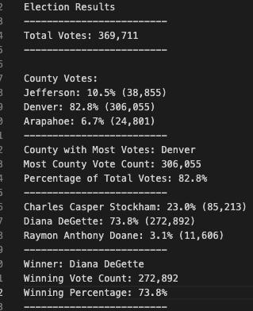

# Election_Analysis
# Overview of Election Audit
  The purpose of this assignment to provide additional results to Seth and Tom. The additonal data that has been requested are "the voter turnout for each county", "the percentage of votes from each county out of the total count" and "the county with the highest turnout". After the additonal information has been obtain, a written analysis will be done to state the results. 
  
# Election_Audit Results
  1. In this congressional election there were 369,711 votes 
  2. The county of Arapahoe had 24,801 votes, which is 6.7% of the congressional votes. The Jefferson county had a total    number of 38,855, which is only 10.5% of the votes. The final county contained the most votes with 306,055 votes from Denver. This accumulate to 82.8% of the total congressional votes.
  3. The county with the largetst number of votes is Denver
  4. In this congressional election there were candidates running. Raymon Anthony Doane had least amount of votes with 11,606. This counts for only 3.1% of the votes. Charles Casper Stockham had the second largest amount of votes with 85,213 votes and this counts to 23% of the votes. Finally, Diana DeGette had the most votes with 272,892 and this counts for 73.8% of the total votes. 
  5. Candidate Diana DeGette was victorious with a total number of 272,892 votes. Diana took 73.8% of the total votes to become victorious.

# Election-Audit Summary
  The script used to provide the information about congressional elections, can also be used for other elections. Such as, budgets, other congressional election, and county additions. For example, if the a county would to provide information based on a recent buget vote. All that has to been is to provide a CSV file that contains all the votes, change the variables to appropreately represent the buget count and then change the summary to show the proper variable for the data. These same moidification could be done with other elections as well. Overall this method is a good way to display the outcomes of election that may arise. 
